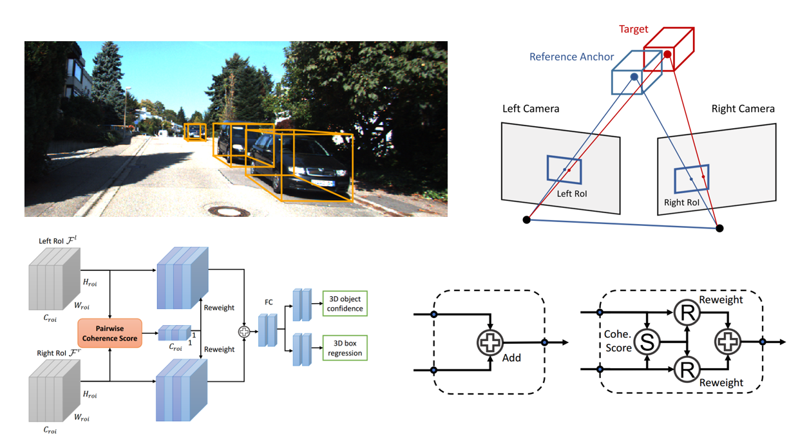

## Triangulation Learning Network: *from Monocular to Stereo 3D Object Detection*

The repository contains an implementation of this [CVPR paper](https://cloud.tsinghua.edu.cn/f/f288147f957f4f8eac75/?dl=1). The detection pipeline is built on [AVOD](https://github.com/kujason/avod).

[](https://cloud.tsinghua.edu.cn/f/4f4584a05ba24ceab956/)

#### [Video Demo](https://cloud.tsinghua.edu.cn/f/4f4584a05ba24ceab956/)

#### [Detection Outputs on KITTI Validation Set](https://cloud.tsinghua.edu.cn/f/3ffac9edd66f4676a3d5/?dl=1)

<br/>

### Related Project
[**MonoGRNet: A Geometric Reasoning Network for 3D Object Localization**](https://github.com/Zengyi-Qin/MonoGRNet)

Please cite this paper if you find the repository helpful:
```
@article{qin2019tlnet, 
  title={Triangulation Learning Network: from Monocular to Stereo 3D Object Detection}, 
  author={Zengyi Qin and Jinglu Wang and Yan Lu},
  journal={IEEE Conference on Computer Vision and Pattern Recognition (CVPR)},
  year={2019}
}
```

### Introduction
we study the problem of 3D object detection from stereo images, in which the key challenge is how to effectively utilize stereo information. Different from previous methods using pixel-level depth maps, we propose to employ 3D anchors to **explicitly construct geometric correspondences** between the regions of interest in stereo images, from which the deep neural network learns to **detect and triangulate** the targeted object in 3D space. We also present **a cost-efficient channel reweighting strategy** that enhances representational features and weakens noisy signals to facilitate the learning process. All of these are flexibly integrated into a baseline detector, achieving state-of-the-art performance in 3D object detection and localization on the challenging KITTI dataset.

### Prerequisites
- Ubuntu 16.04
- Python 3.6
- Tensorflow 1.3.0 

### Dataset
Download the [Kitti Object Detection Dataset](http://www.cvlibs.net/datasets/kitti/eval_object.php?obj_benchmark=3d) and place it into your home folder `~/Kitti/object`. Also download the `train.txt`, `val.txt`, `trainval.txt`, `planes` and `score` from [here](https://cloud.tsinghua.edu.cn/f/af6ca62301df4f14a6e4/?dl=1). The folder `planes` contains the ground planes parameters and `score` is the ground truth 2D objectness confidence maps. The data folder should be in the following format:
```
Kitti
    object
        testing
        training
            calib
            image_2
            image_3
            label_2
            planes
            score
        train.txt
        trainval.txt
        val.txt
```

### Setup
Add `tlnet` to your PYTHONPATH:
```bash
export PYTHONPATH=$PYTHONPATH:'path/to/tlnet'
```
Run the following command to download the pretrained model, compile required modules and generate mini-batches for training:
```bash
python setup.py
```


### Training
Run the training script with specific configs:
```bash
python avod/experiments/run_training.py --pipeline_config=avod/configs/pyramid_cars_with_aug_example.config --data_split='train' --device=GPU_TO_USE
```

### Evaluation
```bash
python avod/experiments/run_evaluation.py --pipeline_config=avod/configs/pyramid_cars_with_aug_example.config --data_split='val' --device=GPU_TO_USE
```

### Inference

```bash
python avod/experiments/run_inference.py --checkpoint_name='pyramid_cars_with_aug_example' --data_split='val' --ckpt_indices=-1 --device=GPU_TO_USE
```
where `--ckpt_indices=-1` indicates running the lastest saved checkpoint. The difference between `evaluation` mode and `inference` mode is that, `inference` does not automatically perform Kitti official evaluation, while `evaluation` does.
